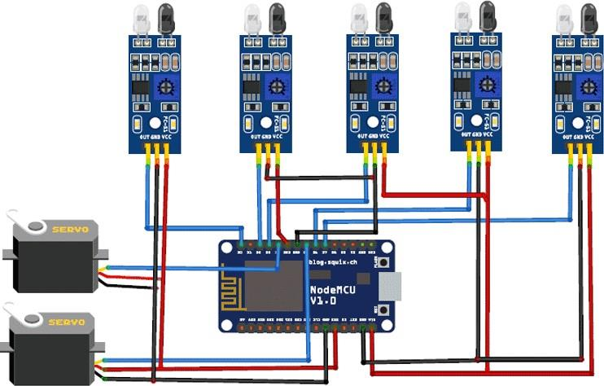

<h1 align="center">Smart Parking System using IoT</h1>

<!-- ABOUT THE PROJECT -->

# Introduction
Nowadays, obtaining parking in congested places is quite difficult, and there is no
mechanism in place to obtain information about parking availability online. Imagine
being able to acquire information on parking space availability on your phone and
without having to go out and verify it. The IoT-based smart parking system can
overcome this problem. You may quickly access the parking space availability
through the internet using the IoT-based parking system. The automobile parking
system may be totally automated using this technique. Everything may be done
automatically, from the time you enter until the time you pay and go.
  
So, utilizing NodeMCU, five IR sensors, and two servo motors, we're creating an IoTbased Car Parking System. Two IR sensors are used to detect the automobile at the
entry and exit gates, and three IR sensors are utilized to determine the availability of
parking slots. The gates are opened and closed using servo motors based on the sensor
data. We're going to use the Adafruit IO platform to illustrate how to publish data to
the cloud and monitor it from anywhere in the globe.
  
When it comes to real-world application, it is obvious that IR sensors or servo motors
used in this project is not feasible, we can use motion sensors which is used in toll
gates in order to detect the vehicles and any other Wi-Fi module can be used based on
the requirements
  
We restricted the usage of firebase data base in our project and shifted to cloud
database as we were aware of the complexities involved in transferring the data from
database to the mobile app or any other user point to make the data visible to the users,
As we are using cloud for now, the user point is a website and it can be viewed in
smartphones or pc and this is how we tried to make the project more efficient.

  

# Circuit Diagram
 

  

# Hardware & Software Requirements

### Hardware Components Used
* [NodeMCU ESP8266](https://en.wikipedia.org/wiki/NodeMCU)
* [IR Sensor](https://www.waveshare.com/wiki/Infrared_Proximity_Sensor)
* [Servo Motor](https://vuejs.org/)
### Software Services Used
* [Adafruit IO](https://io.adafruit.com/)

  

# Functionality

 

Smart parking system works on the principle of detecting obstacle and sending a
visual feedback.
  
The system reads the number of parking slots available and updates data with the
cloud server to allow for checking parking slot availability online. This allows users
to check for available parking spaces online from anywhere and avail hassle free
parking.
  
The device sends measurements to the cloud where they are stored in AWS IoT
shadow as a sensor state. A sensor detects a parked car by measuring the distance to
the nearest obstacle—in our case, to the bottom of the car.

  

# Source Code

View the Source code [here](code.txt)

  

# Results

 

  

# End User Applications

These systems are already being used in many places like shopping malls,
theatres, apartments and hospitals.

You can implement this IOT based project in private parking lots, hospitals,
hotels, shopping malls, public parking garages, offices, etc. to make the parking
hassle free and time consuming.

  

# Conclusion

By doing this project we have come across different kinds of hardware components
that are available and their applications in different fields.
 
We have learnt how to implement them in various platforms and in projects to get the
end product.

  

# Reference
https://iotdesignpro.com/projects/iot-based-smart-parking-using-esp8266
